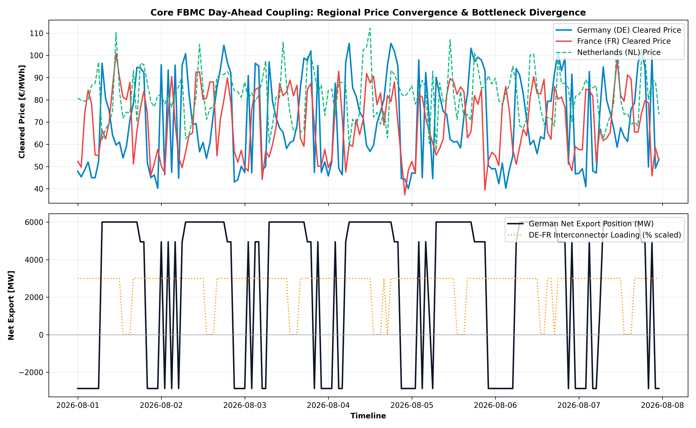

# 🌐 Cross-Border Net Transfer Capacity (NTC) & Flow-Based Market Coupling (FBMC) Engine

> **Multi-zone European Day-Ahead market clearing optimization framework modeling commercial net export positions, PTDF grid sensitivities, and price convergence across the Core FBMC region (DE, FR, AT, NL).**

[](https://www.python.org/downloads/)
[](https://docs.scipy.org/doc/scipy/reference/optimize.linprog-highs.html)
[](https://opensource.org/licenses/MIT)
[](https://cross-border-fbmc-arbitrage-engine-ajgmccslxf85tgsvgwlrxh.streamlit.app/)

---

## 📊 Dashboard & Simulation Preview



---

## 📌 Problem Context & Market Framework

Under the European **Flow-Based Market Coupling (FBMC)** mechanism (the Euphemia market coupling algorithm standard), commercial cross-zonal electricity exchanges are constrained by physical transmission limits on **Critical Network Elements (CNECs)**. 

Instead of simplistic bilateral Net Transfer Capacity (NTC) allocations, FBMC dynamically calculates the available transmission domain using Power Transfer Distribution Factors (PTDF) and Remaining Available Margins (RAM) to maximize total European social welfare.

This engine models:
1. **Multi-Zone Social Welfare Clearing**: Co-optimizing net commercial export/import positions ($NP_z$) across Germany (DE), France (FR), Austria (AT), and the Netherlands (NL).
2. **Physical Grid Sensitivity (PTDF & RAM)**: Enforcing forward and reverse physical line constraints on interconnector bottlenecks.
3. **Price Convergence & Congestion Rent**: Simulating commercial cross-border arbitrage spreads, market decoupling during grid congestion, and congestion rent collection.

---

## 🔬 Mathematical Formulation

### 1. Social Welfare Maximization (Linear Program)
For each market clearing time step $t$, the clearing algorithm minimizes total generation cost / maximizes consumer surplus:

$$\min_{NP} \sum_{z \in \mathcal{Z}} P_{\text{unconstrained}, z}(t) \cdot NP_z(t)$$

### 2. Global Energy Conservation
The sum of all commercial net positions across the coupled synchronous region must equal zero:

$$\sum_{z \in \mathcal{Z}} NP_z(t) = 0$$

### 3. Flow-Based Transmission Constraints
Commercial net positions are mapped to physical active power flows across critical network elements (CNECs) using the PTDF sensitivity matrix:

$$-\text{RAM}_k \le \sum_{z \in \mathcal{Z}} \text{PTDF}_{k, z} \cdot NP_z(t) \le \text{RAM}_k \quad \forall k \in \mathcal{K}$$

### 4. Commercial Net Position Boundaries
$$NP_{z, \text{min}} \le NP_z(t) \le NP_{z, \text{max}} \quad \forall z \in \mathcal{Z}$$

---

## 📂 Repository Architecture

```text
cross-border-fbmc-arbitrage-engine/
│
├── .github/
│   └── workflows/
│       └── ci.yml               # Automated PyTest CI/CD pipeline
├── src/
│   ├── __init__.py
│   ├── fbmc_model.py            # PTDF matrix & RAM margin definitions
│   └── market_coupler.py        # Multi-zone linear programming solver
├── tests/
│   ├── __init__.py
│   └── test_fbmc_engine.py      # Unit & physical conservation test suites
├── app.py                       # Interactive Streamlit dashboard
├── cross_border_simulation.py   # Standalone market clearing & plot script
├── cross_border_fbmc_simulation_results.png # Visual benchmark plot
├── requirements.txt
├── README.md
└── .gitignore
